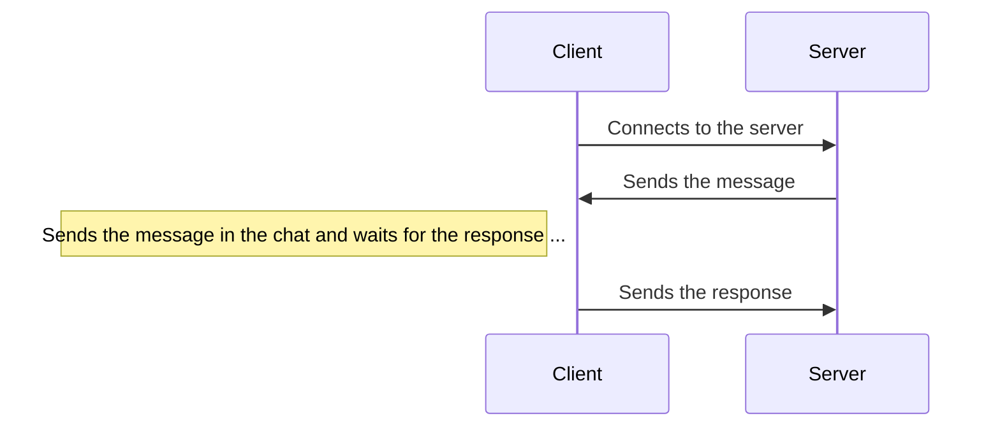
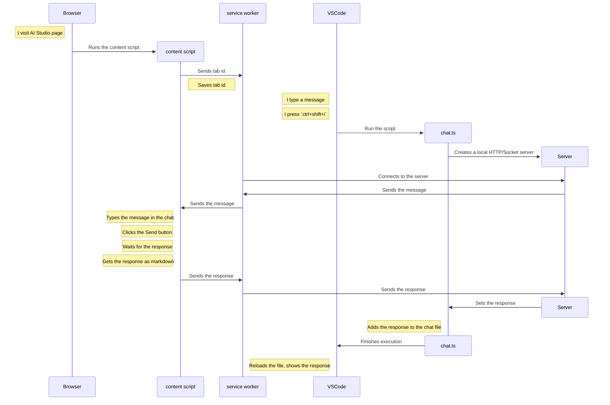

# Chat with Gemini 2.5 Pro from VSCode

The Gemini 2.5 Pro is a good model, and it's free to use on [Google AI Studio](https://aistudio.google.com/), but the UI is not very user-friendly in my opinion. What if I could chat with it from VSCode? Check out the following demo:

[Click here to see it in action](https://www.youtube.com/watch?v=V-CoA2GdmR8)

As you can see, the feature is as follows:
- To start a new chat, I simply hit a shortcut, I choose `ctrl+shift+i`.
- A new chat file is created and opened in the editor.
- I type my message in the markdown file, and press the shortcut `ctrl+shift+i`.
- The file is updated with a loading message.
- After a few seconds, the file is updated with the response from Gemini.
- Then I can continue to chat like that.

Ok, are you wondering how it works? let's see how I implemented it step by step.

## Contents

- [1. Create a new chat file](#1-create-a-new-chat-file)
- [2. Updating the chat file](#2-updating-the-chat-file)
- [3. Interacting with AI Studio in the browser](#3-interacting-with-ai-studio-in-the-browser)
  - [3.1. Attempt 1: Controlling the browser with Playwright](#31-attempt-1-controlling-the-browser-with-playwright)
  - [3.2. Attempt 2: Running a local server and injecting a JS snippet in the browser](#32-attempt-2-running-a-local-server-and-injecting-a-js-snippet-in-the-browser)
  - [3.3. Attempt 3: Creating a browser extension](#33-attempt-3-creating-a-browser-extension)
- [4. Sending the message and getting the response in the browser](#4-sending-the-message-and-getting-the-response-in-the-browser)
- [5. Streaming the response to the file](#5-streaming-the-response-to-the-file)

## 1. Create a new chat file

The first step is to create a new chat file when I press `ctrl+shift+i` and open it.

To implement this, I used the [Neat Scripts](https://github.com/webneat/neat-scripts) extension that I built a while back [in this article](https://dev.to/this-is-learning/how-i-created-an-extension-to-automate-vscode-with-external-scripts-27ni). You don't have to read that article to follow with this one, I will explain how it works here.

The first thing to do it to add the following keybinding to VSCode:

```json
{
  "key": "ctrl+shift+i",
  "command": "neat-scripts.run",
  "args": {
    "script": "/absolute/path/to/chat.ts"
  }
}
```

This tells VSCode to run our `chat.ts` script using the Neat Scripts extension when the `ctrl+shift+i` shortcut is pressed.

So let's create the `chat.ts` script.

```ts
#!/usr/bin/env bun

console.log("Hello World");
```

The first line is called a shebang. It tells the system which interpreter to use to run the script. In this case, I am using [Bun](https://bun.sh/). I also need to make the file executable for that to work; on Linux/Mac, you can do that with the following command:

```sh
chmod +x chat.ts
```

Now if I press `ctrl+shift+i`, the script will run but nothing will happens yet. Let's make it create a new chat file and tell VSCode to open it.

```ts
#!/usr/bin/env bun

async function new_chat() {
  const chat_path = `/tmp/${Date.now()}.chat.md`;
  await Bun.write(chat_path, "");
  console.log(
    JSON.stringify({
      command: "neat-scripts.files.open",
      args: { path: chat_path },
    })
  );
}

await new_chat();
```

Now when the script is run, it will create a new chat file and tell VSCode to open it by printing the following JSON line:

```json
{"command": "neat-scripts.files.open", "args": { "path": "/tmp/<timestamp>.chat.md" }}
```

The Neat Scripts extension receives this JSON line, and calls the `neat-scripts.files.open` to open the file.

That's it, now we are creating a new chat file and opening it.

## 2. Updating the chat file

if we are already inside a chat file, and we press `ctrl+shift+i`, we don't want to create a new chat file, instead, we want to update the current one.

So when our `chat.ts` script is run, it needs to know the current filename. Luckily, the Neat Scripts extension passes the following JSON object to the stdin of the script:

```json
{
  "workspace_path": "/path/to/your/current/workspace",
  "file": "/path/to/your/current/open/file",
  "selections": [ // list of current selections/cursors
    {
      "start": { "line": 1, "col": 1 },
      "end": { "line": 1, "col": 1 }
    }
  ]
}
```

So, let's update our `chat.ts` read the stdin and check the current file:

```ts
#!/usr/bin/env bun

async function new_chat() {
  // ... same code as before
}

async function update_chat(chat_path: string) {
  await Bun.write(chat_path, "Updating ...");
}

async function main() {
  const input = await Bun.file("/dev/stdin").json();
  const filename = input.file;
  if (filename.endsWith(".chat.md")) {
    await update_chat(filename);
  } else {
    await new_chat();
  }
}

main().catch(console.error);
```

Now if the current file is a chat file, the script will write "Updating ..." to it.

Let's now improve this updating logic, the `update_chat` function should do the following:
- Read the current content of the chat file
- Split the content into messages
- Take the last message and send it to Gemini on AI Studio (we will mock this part for now)
- Receive the response from Gemini (we will mock this part for now)
- Add the response to the chat file

To separate messages in the chat file, let's use the following format:

```md
message 1

---chat-separator---

message 2

---chat-separator---

...
```

Here is the resulting code of the `update_chat` function:

```ts
import { setTimeout } from "timers/promises";

const chat_separator = `\n\n---chat-separator---\n\n`;

async function update_chat(chat_path: string) {
  const content = await Bun.file(chat_path).text();
  await Bun.write(chat_path, `${content}${chat_separator}Loading...`);

  const last_message = content.split(chat_separator).at(-1)!;
  const response = await send_message(last_message);
  await Bun.write(chat_path, `${content}${chat_separator}${response}${chat_separator}`);
}

async function send_message(message: string) {
  await setTimeout(5000);
  return "Fake response";
}
```

Now when I type something in the chat file, and press `ctrl+shift+i`, I see

```md
My message

---chat-separator---

Loading...
```

Then after 5 seconds, I see

```md
My message

---chat-separator---

Fake response

---chat-separator---

```

So the chat updating logic is working.

## 3. Interacting with AI Studio in the browser

This is the most interesting part. The `send_message` function needs to send the message on the AI Studio UI, wait for the response, then return it as markdown.

You may ask "Why don't you just use the API?". The API currently has a ratelimit of 25 free requests per day, which is low. While the number of messages I can send via the AI Studio interface seems unlimited.

### 3.1. Attempt 1: Controlling the browser with Playwright

My first idea was to run an instance of Chrome and control it using [Playwright](https://playwright.dev/). So I created a file `browser.ts` and wrote the following code to:

- Run an instance of Chrome with `headless: false` so that I can see what's happening.
- Open Google.
- Login using my credentials that I stored in `.env` file.
- Open AI Studio.
- Write "Hello there!" in the chat.
- Send a message.

```ts
import { env } from "bun";
import { setTimeout } from "timers/promises";
import { chromium, devices } from "playwright";

const browser = await chromium.launch({ headless: false });
const context = await browser.newContext(devices["Desktop Chrome"]);
const page = await context.newPage();

await page.goto("https://google.com/");
await page.click('[aria-label="Connexion"]');
await page.fill('[name="identifier"]', env.GOOGLE_EMAIL!);
await page.click("#identifierNext");
await page.fill('[name="Passwd"]', env.GOOGLE_PASSWORD!);
await page.click("#passwordNext");
await setTimeout(3000);
await page.goto("https://aistudio.google.com/prompts/new_chat");
await page.click('button[aria-label="close"]');
await page.click('textarea[aria-label="Type something"]');
await page.fill('textarea[aria-label="Type something"]', "Hello there!");
await page.click("run-button");
```

All steps worked fine, but when the `Send` button is clicked, I get a permissions error. it seems that the AI Studio backend blocks requests from automated browsers.

I could think of ways to bypass that, but I decided to try a different approach.

### 3.2. Attempt 2: Running a local server and injecting a JS snippet in the browser

The second idea was to create a server on my localhost and insert a client JS code to communicate with it using websockets.



#### 3.2.1. Creating the HTTP server

Let's create a server when `send_message` is called, it will simply print a message when the client connects or sends a message for now.
I will also close the server after 30 seconds and return a fake response.

```ts
const server_port = 3331;

async function send_message(message: string) {
  const server = Bun.serve({
    port: server_port,
    websocket: {
      open(ws) {
        console.log("WebSocket connection opened");
      },
      message(ws, message) {
        console.log("Message received:", message);
      },
    },
    fetch(req, server) {
      if (req.url.endsWith("/chat")) {
        server.upgrade(req);
        return;
      }
      return new Response("Hello World");
    },
  });
  await setTimeout(30_000);
  await server.stop();
  return "Fake response";
}
```

Now when I type a message in the chat file and press `ctrl+shift+i`, then visit `http://localhost:3331`, I see "Hello World". So the server is running. But I can't see what it prints because I don't have access to stdout of the script.

Let's replace the `console.log` calls with the following `log` function; it will print a JSON command that shows the message as a notification on VSCode.

```ts
function log(message: string) {
  console.log(
    JSON.stringify({
      command: "neat-scripts.notifications.info",
      args: { message },
    })
  );
}
```

#### 3.2.2. Creating the client

Let's write the JS code that will connect to the server from the browser.

```js
(function() {
  const ws = new WebSocket('ws://localhost:3331/chat');
  ws.onmessage = (event) => {
    console.log('Message received:', event.data);
  };
})();
```

When I paste the JS code into the browser console on the `http://localhost:3331` page, I see that the socket connection is opened and the message sent by the server is received by the client.
But pasting the same code in the AI Studio page doesn't work:

- First I had CORS error that I fixed by adding some headers to the server response.
- Then I had a Mixed Content error because AI Studio is on a secure protocol (HTTPS) while my local server is on HTTP.

As this point I could think of the following options:

- Create a local domain and generate SSL certificates for it using [Let's Encrypt](https://letsencrypt.org/), and use it for my server.
- Create a tunnel to my local server using a tool like [ngrok](https://ngrok.com/).
- Create a browser extension to communicate with my local server using a background service worker.

I decided to go with the browser extension option. Why? because it's a chance to learn more about service workers in the browser.

### 3.3. Attempt 3: Creating a browser extension

#### 3.3.1. Creating a separate server

To make testing easier, instead of having our `chat.ts` script start the server each time we call it. Let's create the server separately and keep it running in the background. To do that, I created `server.ts`:

```ts
Bun.serve({
  port: 3331,
  websocket: {
    open(ws) {
      console.log("WebSocket connection opened");
    },
    message(ws, message) {
      console.log("Message received:", message);
    },
  },
  fetch(req, server) {
    if (req.url.endsWith("/chat")) {
      server.upgrade(req);
      return;
    }
    return new Response("Hello World");
  },
});
```

#### 3.3.2. Creating the browser extension

With that server running, let's create the browser extension. I created the following files:

```
extension/
  manifest.json
  worker.js
  content.js
```

The `manifest.json` file describes the extension:

```json
{
  "manifest_version": 3,
  "name": "Gemini VSCode Chat",
  "version": "1.0",
  "description": "Chat with Gemini from VSCode",
  "permissions": [],
  "host_permissions": [
    "https://aistudio.google.com/*"
  ],
  "background": {
    "service_worker": "worker.js"
  },
  "content_scripts": [
    {
      "matches": ["https://aistudio.google.com/prompts/*"],
      "js": ["content.js"],
      "run_at": "document_idle"
    }
  ]
}
```

The important parts are:
- We are using manifest version 3.
- We don't require any special permissions.
- `host_permissions` specifies that we need access to the AI Studio domain.
- `background` specifies the background service worker file.
- `content_scripts` specifies the content script file (the JS code that will be injected into the AI Studio page).

Next we create the files `worker.js` and `content.js`. Let's have them simply console.log something.

**worker.js**:

```js
console.log("Background service worker started.");
```

**content.js**:

```js
console.log("Content script loaded.");
```

To test the extension, we can load it in Chrome:

1. Open Chrome and go to `chrome://extensions/`.
2. Enable "Developer mode".
3. Click "Load unpacked" and select the `extension` directory.

Now when I visit the AI Studio page, I see the "Content script loaded." message in the console. So our extension is working.

#### 3.3.3. Socket communication between the service worker and the local server

Next step is to implement the socket communication between the service worker and the local server.

**worker.js**:
```js
const ws = new WebSocket("ws://localhost:3331/chat");
ws.onmessage = (event) => {
  console.log("Message received:", event.data);
  ws.send("Hello from service worker");
};
```

**server.ts**:
```ts
Bun.serve({
  port: 3331,
  websocket: {
    open(ws) {
      console.log("WebSocket connection opened");
      ws.send("Hello from server");
    },
    message(ws, message) {
      console.log("Message received:", message);
    },
  },
  // ...
});
```

The communication will happen as follows:
- Service worker opens a WebSocket connection to the server (`new WebSocket("ws://localhost:3331/chat")`).
- Server receives the connection, prints "WebSocket connection opened" and sends a message "Hello from server". (The `open` callback).
- Service worker receives the message, prints "Message received: Hello from server" and sends a response "Hello from service worker".
- Server receives the response, prints "Message received: Hello from service worker".

So after restarting the server and reloading the extension, I see the following messages:

**the server console**:

```text
WebSocket connection opened
Message received: Hello from service worker
```

**the service worker console**:

```text
Message received: Hello from server
```

#### 3.3.4. Communication between the service worker and the content script

The communication between the service worker and the content script can be done with the `chrome.runtime.sendMessage`, `chrome.runtime.onMessage`, `chrome.tabs.query` and `chrome.tabs.sendMessage` APIs.

Here is a quick explanation of the usage of each one of them:

**`chrome.runtime.sendMessage`**:

Sends a message from the content script to the service worker.

```js
const response = await chrome.runtime.sendMessage({ message: "Hello from content script" });
```

if the service worker sends back a response, it will be available in the `response` variable.

**`chrome.tabs.sendMessage`**:

Sends a message from the service worker to the content script on a specific tab.

```js
const response = await chrome.tabs.sendMessage(tabId, { message: "Hello from service worker" });
```

The `tabId` identifies the tab where the content script is running. One way to get it is from the `sender` object in the `chrome.runtime.onMessage` listener.

**`chrome.runtime.onMessage`**:

Listens for messages sent via `runtime.sendMessage` or `tabs.sendMessage`, can be used in both content scripts and service workers.

```js
chrome.runtime.onMessage.addListener((message, sender, sendResponse) => {
  console.log("Message received:", message);
  console.log("sender tabId:", sender.tab?.id);
  // handle the message
});
```

Note that the `sender.tab` is only defined if the sender is a content script. In that case it contains the tab object from which we can grab the id to use with `chrome.tabs.sendMessage`.

Now let's use these functions to implement the following simple communication between the service worker and the content script:

1. When the content script is first loaded, it sends a "Hi" message to the service worker.
2. The service worker receives the message, saves the tab id for the future, and sends a response "Welcome".
3. After 10 seconds, the service worker sends a "Are you still there?" message to the content script.
4. The content script receives the message and responds with "Yes!".

**content.js**:
```js
console.log("Gemini VSCode Chat: Content script loaded.");

(async () => {
  const response = await chrome.runtime.sendMessage("Hi");
  console.log("Response:", response);
  chrome.runtime.onMessage.addListener((message, sender, sendResponse) => {
    console.log("Message received:", message);
    if (message === "Are you still there?") {
      sendResponse("Yes!");
    }
  });
})();
```

**worker.js**:
```js
console.log("Background service worker started.");

(async () => {
  let tabId = null;
  chrome.runtime.onMessage.addListener((message, sender, sendResponse) => {
    console.log("Message received:", message);
    if (message === "Hi") {
      tabId = sender.tab?.id;
      sendResponse("Welcome");
    }
  });

  setTimeout(async () => {
    if (tabId) {
      const response = await chrome.tabs.sendMessage(
        tabId,
        "Are you still there?"
      );
      console.log("Response:", response);
    } else {
      console.log("No tab found!");
    }
  }, 10000);
})();
```

#### 3.3.5. Putting it all together

Now let's put it all together, here is the complete flow:



Let's implement this full communication, I will mock the part where the content script interacts with the DOM for now, and tackle it in the next section.

**content.js**

Let's start with the content script since it's the one that should be executed first. It needs to do the following:

1. Send a message to the service worker (so that it can save the tab id)
2. Listen for messages from the service worker. When a message is received, it will simply wait 5 seconds then respond with a fake response.

```js
(async () => {
  chrome.runtime.sendMessage("new tab");
  chrome.runtime.onMessage.addListener((message, _, sendResponse) => {
    setTimeout(() => sendResponse("a fake response ..."), 5000);
    return true;
  });
})();
```

**worker.js**:

Now let's write the code for the background service worker. It should do the following:

1. Wait for a message from the content script and save the tab id.
2. Try to connect to the local server via sockets in a loop. If failed, try again after 1 second.
3. Once connected, receive the chat message from the server.
4. Send the chat message to the content script and wait for a response.
5. Send the response back to the server.

```js
let tabId = null;

async function wait(ms) {
  return new Promise((resolve) => setTimeout(resolve, ms));
}

async function connect_to_server() {
  while (true) {
    await wait(1000);
    try {
      const ws = new WebSocket("ws://localhost:3331/chat");
      await new Promise((resolve, reject) => {
        ws.onopen = resolve;
        ws.onerror = reject;
      });
      return ws;
    } catch {}
  }
}

async function get_server_message(ws) {
  return new Promise((resolve) => {
    ws.onmessage = (event) => {
      resolve(event.data);
    };
  });
}

async function main() {
  chrome.runtime.onMessage.addListener((_, sender) => {
    tabId = sender.tab?.id;
  });
  while (true) {
    while (!tabId) {
      await wait(1000);
    }
    const ws = await connect_to_server();
    const message = await get_server_message(ws);
    const response = await chrome.tabs.sendMessage(tabId, message);
    ws.send(response);
    await wait(1000);
    ws.close();
  }
}

main();
```

**chat.ts**

And the last part is the local server code as part of the `chat.ts` script. The `send_message` function should do the following:

1. Create a local server that listens on port `3331`.
2. Listens for socket connections to `ws://localhost:3331/chat`.
3. When a socket connection is open, send the message to the client.
4. Wait for a response from the client.
5. When a response is received, stop the server and return it.

```ts
async function send_message(message: string) {
  return new Promise((resolve) => {
    const server = Bun.serve({
      port: server_port,
      websocket: {
        open(ws) {
          ws.send(message);
        },
        message(_, message) {
          respond(message.toString());
        },
      },
      fetch(req, server) {
        if (req.url.endsWith("/chat")) {
          server.upgrade(req);
          return;
        }
        return new Response("Hello World");
      },
    });
    const respond = async (message: string) => {
      resolve(message);
      await server.stop(true);
    };
  });
}
```

That's it for the communication between different parts.

At this stage, when I write my message on VSCode and wait about 5 seconds, The "a fake response ..." is added to the chat file. All that remains is to replace this with the actual response from Gemini as markdown.


## 4. Sending the message and getting the response in the browser

This part can be divided into the following steps:

1. Writing the message in the textarea and sending it.
2. Waiting for the response.
3. Extracting the response as markdown and sending it to the service worker.

### 4.1. Writing the message in the textarea and sending it

First I inspected the elements in the AI Studio chat page and wrote selectors for the textarea and the send button.

- textarea: `textarea[aria-label="Type something"]`.
- send button: `button[aria-label="Run"]`.

Then my first attempt was to write the following:

```js
const textarea = document.querySelector('textarea[aria-label="Type something"]');
const button = document.querySelector('button[aria-label="Run"]');
textarea.value = message;
button.click();
```

But this code doesn't work, the message is inserted in the textarea but the button stays disabled and the click does nothing.

After some experiments, all I needed to do is to dispatch an `input` event after setting the value of the textarea, and wait a little bit for the button to become enabled.

```js
(async () => {
  const textarea = document.querySelector('textarea[aria-label="Type something"]');
  const button = document.querySelector('button[aria-label="Run"]');
  textarea.value = message;
  textarea.dispatchEvent(new Event('input', { bubbles: true, cancelable: true }));
  await new Promise(resolve => setTimeout(resolve, 500));
  button.click();
})();
```

Now the message is sent correctly!

### 4.2. Waiting for the response

When the send button is clicked, its text changes from "Run" to "Stop", I can do that and wait while the text "Stop" appears in the button.

```js
(async () => {
  // ... previous code
  button.click();
  await new Promise(resolve => setTimeout(resolve, 1000));
  while (button.innerText.indexOf("Stop") !== -1) {
    await new Promise(resolve => setTimeout(resolve, 500));
  }
  console.log("Response received");
})();
```

### 4.3. Extracting the response as markdown and sending it to the service worker

For this step, I want to do the following:

1. Hover over the chat response
2. Click on the options button (the three dots icon that appears at top right)
3. Click on the "Copy markdown" item
4. Inspect the copied text and send it to the service worker

I examined the DOM elements and noticed that each chat message/response is inside an element `ms-chat-turn`. So I can get the last message element with
```js
const last_message_container = Array.from(document.querySelectorAll("ms-chat-turn")).pop();
```

The options button is inside that container, I can select it with `button[aria-label="Open options"]` and click it.
```js
const options_button = last_message_container.querySelector('button[aria-label="Open options"]');
options_button.click();
```

Then a menu appears with options, I can select the icon inside the "Copy markdown" option and click it.
```js
const markdown_span = document.querySelector('span.copy-markdown-button');
markdown_span.click();
```

This will insert the markdown text into the clipboard. But will fail if the tab is not focused (which will be the case in my usage). So I need a way to intercept what is being copied to the clipboard and send it to the service worker.

First I need to know which API is used to copy to the clipboard, so I wrote the following code and run it in the browser console:

```js
navigator.clipboard.writeText = (text) => console.log('navigator.clipboard.writeText', text);
navigator.clipboard.write = (data) => console.log('navigator.clipboard.write', data);
document.execCommand = (command, showUI, value) => console.log('document.execCommand', command, showUI, value);
ClipboardEvent.prototype.setData = function(format, data) {
  console.log('ClipboardEvent.prototype.setData', format, data);
};
```

This will mock the different APIs that could be used and log a message when one is called. Now I simply had to click the "Copy markdown" button and check the console. I saw:

```
document.execCommand copy undefined undefined
```

So Google are using the `document.execCommand('copy')` API to copy to the clipboard, which means that they are selecting the text right before calling that API. Then I can intercept that call and get the selected text.

```js
const original_fn = document.execCommand;
document.execCommand = (...args) => {
  if (args[0] === "copy") {
    const text = document.activeElement.value;
    console.log("Copied markdown", text);
  }
  return original_fn.apply(document, args);
};
```

This code works when I paste it in the console, but doesn't when I add it to the content script.

After spending some time debugging and readig more about how extensions work, I realized that the content script runs in a different Javascript context than the actual page, they only share access to the DOM. So when I was mocking `document.execCommand`, I was mocking it in the context of the content script, not the actual page.

So I need to get the copied text only via the DOM. Let's think again what happens when I click the "Copy markdown" button:

- A textarea is created, its value is set to the markdown.
- The textarea is inserted into the DOM.
- The textarea content is selected.
- The copy command is executed.

What if I could listen for changes to the DOM and get the inserted textarea, I could then get the markdown by simply doing `textarea.value`. Luckily there is an API to do exactly that: [`MutationObserver`](https://developer.mozilla.org/en-US/docs/Web/API/MutationObserver).

```js
const observer = new MutationObserver((mutations) => {
  mutations.forEach((mutation) => {
    mutation.addedNodes.forEach((node) => {
      if (node.tagName === "TEXTAREA") {
        console.log("Textarea's text", node.value);
      }
    });
  });
});
observer.observe(document.body, { childList: true, subtree: true });
```

This code will log the text of the textarea when it is added to the DOM.

Putting it all together, the final code for the function that gets the response as markdown is:

```js
async function get_response() {
  const last_message_container = Array.from(document.querySelectorAll("ms-chat-turn")).pop();
  const options_button = last_message_container.querySelector('button[aria-label="Open options"]');
  options_button.click();
  let response = null;
  const observer = new MutationObserver((mutations) => {
    mutations.forEach((mutation) => {
      mutation.addedNodes.forEach((node) => {
        if (node.tagName === "TEXTAREA") {
          response = node.value;
        }
      });
    });
  });
  observer.observe(document.body, { childList: true, subtree: true });
  const markdown_span = document.querySelector("span.copy-markdown-button");
  markdown_span.click();
  await new Promise((resolve) => setTimeout(resolve, 2000));
  while (!response) {
    await new Promise((resolve) => setTimeout(resolve, 500));
  }
  observer.disconnect();
  return response;
}
```

## 5. Streaming the response to the file

Right now, we wait for the full response to be streamed to the browser before appending it all at once to the file. It can be better to stream the response to the file as it is received, this way I can start reading the response while it is still streaming.

To do that, I updated the content script to send the current response every 300ms while it's being streamed. Then updated the service worker to send those partial responses to the server, and updated the chat.ts to rewrite the file with each partial response.

I will not bore you with the full code here, you can check it out on GitHub: https://github.com/webneat/gemini-chat

## Conclusion

This was a fun little project that made me learn new things about Chrome extensions.

Let me know what you think about it, would you use this tool if I make easier to install (proper VSCode and browser extensions)? would you like it to support other AI chats (ChatGPT, Claude, ...)? what other features would you like to see?

You can check the full code on GitHub: https://github.com/webneat/gemini-chat
